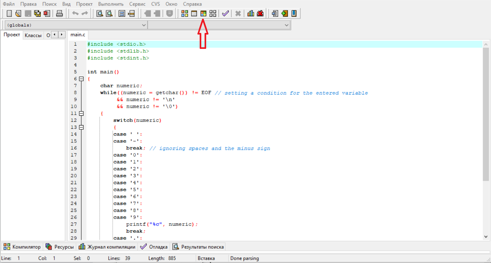

# The first Homework assignment on the subject: "Functional Logic and the Theory of Algorithms"
## *Task condition (variant № 3):*
> "The user enters a floating-point number. 
> Read the number and output the integer and fractional parts separately.
> Provide for the possibility of leading zeros in the fractional part.
> Bonus: ensure that input constraints
> are handled (for example, if a number is read as a string, then terminate the program when the specified length is exceeded).
> Input example: 10.05
> Output example: 10 | 05"


### Project assembly:
The program is written in the Windows operating system, in the Dev-C++ application in the C programming language.


### Explanation of the algorithm of the code:
After entering a variable and reading it, we check it for the following conditions:
as long as the character-by-character reading is not equal to the end of the line / file, the value iteration operator switch case default is called. 
```c   
	char numeric;
	while((numeric = getchar()) != EOF // setting a condition for the entered variable
             && numeric != '\n' 
             && numeric != '\0')
        {
            switch(numeric) 
            {
```
Spaces and "minus" characters are ignored:
```c
	case ' ':
        case '-':
            break; // ignoring spaces and the minus sign
```
If the constant expression is equal to any digit in the range from 0 to 9, it is displayed on the screen:
case '0':
```c
	case '1':
        case '2':
        case '3':
        case '4':
        case '5':
        case '6':
        case '7':
        case '8':
        case '9':
            printf("%c", numeric);
            break;
```
The "." sign is replaced by "|":
```c   
	case '.':
            printf(" | "); // replacing characters
            break;
``` 
Otherwise, the program will inform us about the error:
```c	
	default:
	    printf("\n\nError\n\n"); // informing about an error
	    exit(-1);
	}
    }
```
Then the program terminates: 
```c
    printf("\n");
    exit(0);
```
---
### Launch the project: 
To start the project, you need to open the main.c file in the Dev-C++ application. 
Next, you need to click on the "Compile and execute" button or press F11



